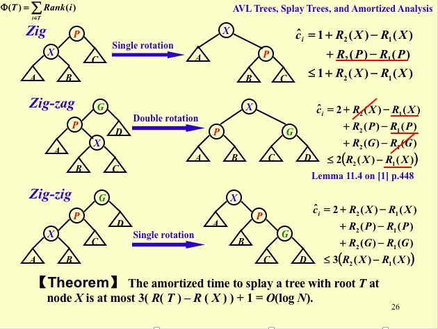
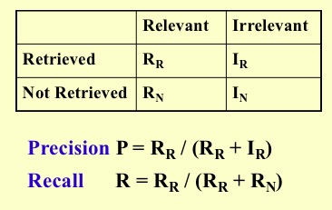
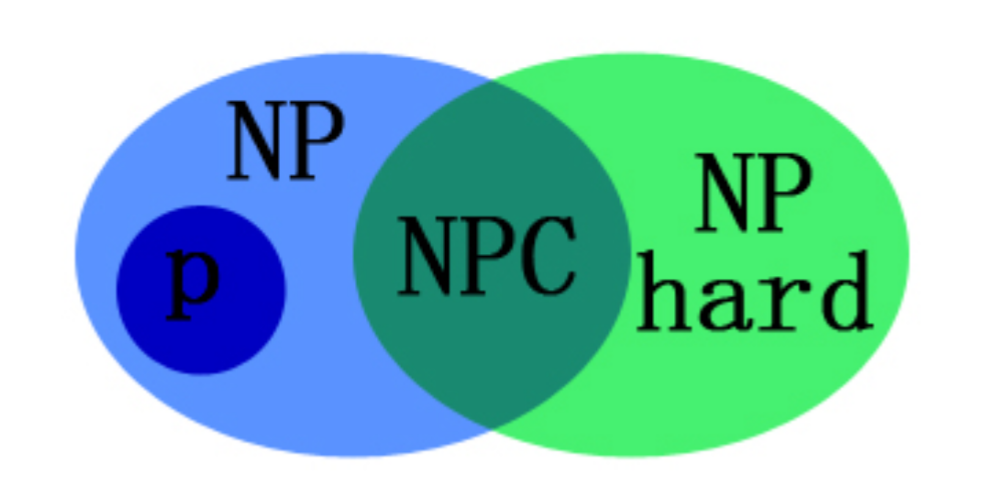

# ADS

### Binary Search Tree

- 特点
  - 左节点 < 父节点 < 右节点
- 树的高度：从根到叶子节点的最大路径长，所有叶子高度为0。
- 树的深度：从根到叶子节点的最大路径长，根的深度为0。
- 删除（递归，非懒惰）
  - 找到要删除的节点
  - 使用它左子树最大的节点 / 右子树最小的节点的值替换
  - 进入删除用于替换的节点的流程继续上一步操作

### AVL Tree

- 特点
  - 平衡二叉树
  - 每个节点左右高度差不超过1：balance factor BF = h~L~ - h~R~
- 节点结构
  - 数据
  - 左子树指针
  - 右子树指针
  - 节点高度
- 基本操作
  - 单旋：LL、RR
  - 双旋：LR = RR + LL、RL = LL + RR
  - 每次复杂度：$O(log {n})$
  - 一次插入/删除后只需操作一次即可
- 插入（一般采用递归写）
  - 找到合适位置
  - 插入后，上溯到左右节点高度差为2的位置P
  - 如果子节点的高度差同号，则执行单旋；反之执行双旋。并更新子节点高度为其左右子树高度较大者 + 1，单旋更新2次，双旋更新4次
  - 更新节点P高度为左右子树高度较大者 + 1
- 删除（同二叉树的删除）
- 给定树高h，最小节点数计算
  - 画图分析可知：n~h~ = n~h-1~ + n~h-2~ + 1，即左子树节点数 + 右子树节点数 + 根
  - 又：n~0~ = 1
  - 通过斐波那契数列的通项公式得：$n_{h} = Fib(h + 2) - 1 \approx \frac{1}{\sqrt{5}}(\frac{1 + \sqrt{5}}{2})^{h+2} - 1$
  - 由此可知$h = O(log {n})$

### Splay Tree

- 特点：
  - 不一定平衡的二叉树
  - 每访问一次某节点就会将该节点移动到根部
  - M次连续操作的总复杂度为：$O(Mlog{N})$
- 节点结构
  - 数据
  - 左子树指针
  - 右子树指针
- 基本操作：
  - Zig-Zag：即LR或RL双旋
  - Zig-Zig：即两次LL或RR单旋
- 查找
  - 找到节点
  - 找到后通过基本操作调整至根部
  - 单次复杂度：$O(n)$
- 插入
  - 找到合适位置
  - 插入后通过基本操作调整至根部
  - 单次复杂度：$O(n)$
- 删除（同二叉树的删除）

### 摊还分析 Amortized Analysis

- 最坏情形复杂度 $\leq$ 摊还复杂度 $\leq$ 平均情形复杂度

- **聚合分析 Aggregate analysis**：确定n个操作的总代价上界为T(n)，单次平均代价为T(n)/n。

- **核算法 Accounting method**：将操作序列中较早操作的余额作为“信用”存储，与数据结构的特定对象关联，随后用于支付摊还代价与实际代价的差额。

- **势能法 Potential method（重）**：与核算法类似，分析每个操作的代价，但是将势能作为一个整体函数，与某个对象无关。操作的摊还代价的计算为操作实际代价加上操作引起的势能变化。

  - 定义势函数f（xn），每次操作的摊还代价ci‘ = 真实代价ci + f（xn）- f（xn-1）
  - 总操作的摊还代价为 sigma ci’ = sigma ci + f（xn）- f（x0）

- 实例：
  - 栈操作（有pop、push以及multipop）
    - 聚合分析
      - 栈大小为n，最坏情况下multipop为O（n），故n次操作最坏代价O（n2），平均每次O（n），但这不是紧确界；
      - 在一个空栈执行n个push、pop和multipop操作，代价最多为O（n），因为当一个对象压入栈后至多弹出一次。故任意一个n次操作序列代价O（n），单次操作代价为O（1）。
    - 核算法
      - 设push代价为2，pop代价为0，multipop代价为0，而其实际代价为（1，1，min（k，size））；
      - push操作时支付2单位代价，其中1单位支付实际代价，1单位作为信用。这样，**每一个插入的元素**都具有1美元的信用；在pop和multipop中弹出该元素时，不缴纳额外的费用，而是使用信用支付代价，故总摊还代价为O（n），平均操作代价为O（1）。
    - 势能法
      - 对一个初始数据结构进行n次操作。ci表示第i个操作的实际代价，di表示执行第i次操作后得到的数据结构，势函数定义为f（di）= sizeof（di）；
      - push代价为1 + 1 = 2，pop代价为1 - 1 = 0，multipop代价和pop一样为0.
      - 故每个操作的摊还代价为O（1），n个操作的摊还代价为O（n）。

  - 二进制计数器递增（真实代价与进位翻转的位数程线性关系）

    - 聚合分析
      - 最坏情况下一次+1的cost为O（k），n次为O（nk），但这不是紧确界。
      - 每两次才会反转所有的位；最后一位每次操作都会反转1次，倒数第二位为两次操作反转一次，故第i位的反转次数为n/2^i，n个操作总次数为$\sum_{i=0} ^{k-1}{\frac{n}{2 ^i}}<\sum_{i=0} ^{\infin}{\frac{1}{2 ^i}} = 2n.$
      - 所以总摊还代价为O（n），单次代价为O（1）。
    - 核算法
      - 每次操作置0 -> 1，缴费2单位，1单位用于支付实际代价，另一单位存在该位作为信用来支付未来的复位操作。
      - 因为每个操作最多置位一次，因此摊还代价为2单位。所以n次操作总代价为O（n）。
    - 势能法
      - 定义势函数为每次操作后计数器中1的个数bi。
      - 假设第i个操作将ti个位复位，则实际代价为ti + 1。
      - 若bi = 0，则bi-1 = ti = k；若bi > 0，则bi-1 - ti + 1。
      - 综上，bi < bi-1 - ti + 1，故势能差为f（di）- f（di-1）<= bi-1 - ti + 1 - bi-1 = 1 - ti。
      - 所以摊还代价为ci‘ = ci + 1 - ti = ti + 1 - 1 - ti = 2，故n次操作摊还代价为O（n）。

  - 伸展树操作

    - 聚合分析

      - 单次操作复杂度上限为O（n），但这不是紧确界。
      - ？？？

    - 核算法

      - ？？？

    - 势能法

      - 定义势函数为sigma rank（i），其中rank为每个节点下子节点的个数。
      - 为简化计算，rank（i）可以近似等价于i的高度，也就是O（log（n））的级别。

      

      - 故单个操作的摊还代价ci‘ < 1 + 3(R2(X) - R1(X))。

  - 斜堆（详见***斜堆部分***）

### R-B Tree

- 特点：

  0. 是一种二叉搜索树

  1. 每个节点非黑即红
  2. 根是黑的
  3. 叶（即NIL）是黑的
  4. 红节点的孩子是黑的
  5. 每个点到后代的叶子节点路径上包含等数量黑点

- 定义和引申：

  - 黑高bh（x）：每个节点（不连自身）到叶子节点的黑点数。
  - 叶节点是NIL，即空节点，不保存数据，表示树的结束。
  - 内点为除了根和叶（NIL）外的点（也就是除了根以外有数据的点）。
  - 每个节点都有两个孩子（包括NIL），而且红点要么两个孩子是NIL，要么两个孩子是黑内点。
  - **黑高一致保证了从根到任意一个叶节点的最长长度都不会超过最短长度的2倍**：
    - 首先，因为长度 = 黑点数 + 红点数，由于黑点数相等，最短长度一定是全黑或者红点最少的路径，那么只要比较某一条路径上红点数和黑点数；
    - 其次由于红点最多时也是与黑点交替出现，故一条路径上红点不会超过黑点的数量，所以路径长度不会超过黑高的二倍。
  - 红黑树是2-3树的一种等价变形。
  - **左旋：P和右儿子P‘，左旋后P变成了P’的左儿子。**
  - **右旋：P和左儿子P‘，右旋后P变成了P‘的右儿子。**

- 引理：一个有n个内点的红黑树值少高为$2ln(N + 1)$。

  - 证明第1步：每个节点为根的子树包含节点数量$sizeof(x) \geq 2 ^{bh(x)} - 1.$
  - 证明第2步：$bh(x) \geq h(Tree) / 2$

- 基本操作：

  - 找父亲
  - 找叔父
  - 找兄弟

- **插入**（*原地算法，因为是尾递归的*）

  - 增加节点P并标记为红色。
  - 根据情况改变颜色和旋转：
    - 1，检查 P是否为根
      - 改为黑色，**返回**。
      - 如果不是根，进入2。
    - 2，P的父亲是黑色
      - 不用操作，**返回**。
      - 如果不是黑色，进入3。
    - 3，P的父亲和叔父都是红色：
      - 先将父亲和叔父变黑，将祖父变红；再以祖父为当前节点P进入1。
      - 如果不是这种情况，进入4。
    - 4，（此时一定父亲红而叔父黑，且祖父黑）分两种对称情形：
      - 如果父亲是祖父的左儿子，P是父亲的右儿子：左旋交换P和父亲，以父亲为当前节点P进入5。
      - 如果父亲是祖父的右儿子，P是父亲的左儿子：右旋交换P和父亲，以父亲为当前节点P进入5。
      - 如果都不是，进入5。
    - 5，（此时一定父亲红而叔父黑，且祖父黑），**首先将父亲改成黑色，祖父改成红色，**再分两种对称情形：
      - 如果P是父亲的左儿子且P的父亲是祖父的左儿子：右旋祖父和父亲。
      - 如果P是父亲的右儿子且P的父亲是祖父的右儿子：左旋祖父和父亲。

- **删除**

  - 找到要删除的节点，分成三种情况：
  - 1，孩子都是叶子节点：
    - 删除即可。
  - 2，孩子有一个叶子节点：
    - 删除之后取非叶子节点的节点替代即可。
  - 3，孩子是两个非叶子节点：
    - 找到左子树最大的节点，将其与当前点交换值，并将交换后的节点删除。如果有替换上来的孩子，那么将它作为当前节点N；如果没有孩子替换上来，那么就直接**结束**。**/ * *这个节点要么只有两个NIL孩子，要么只有一个非叶子的孩子，有两个非叶子节点的话它就不是最大的节点* * /**
    - 3-1，N是根：
      - 直接返回。
    - 3-2，N的兄弟是红的：
      - 兄弟改黑，父亲改红，兄弟与父亲旋转上位。
      - 进入3-3（因为原来兄弟是红，它的儿子必是黑的，也就是转接给原来的父亲后变成现在N的兄弟节点是黑的，至于兄弟的儿子需要再判断）。
    - 3-3，N的兄弟是黑的且兄弟的儿子也都是黑的：
      - 兄弟改红，以父亲为当前节点重新判断3-1。
      - 否则进入3-4。
    - 3-4，N的兄弟是黑的且兄弟儿子一红一黑：
      - 红儿子节点上位，改黑；原来的兄弟改红。

  ---

### B+Tree（坑爹的（cy版）b+树）

- order M：
  - **M=3，指针最多有3个，索引节点最多有2个数，叶子节点最多有3个数**
  - **M=4，指针最多有4个，索引节点最多有3个数，叶子节点最多有4个数**
  - **这个定义和外界公认的b+树不一样，一般认为索引节点和叶子节点的最大key数量应该是相等的！**
  - 根要么是叶子节点，要么有2到M个孩子。
  - 非叶节点（**除了根以外**）都有ceil（M/2）到M个孩子（指针，不是key）。
  - 所有叶子等高（都在最后一层）。
- 深度计算：O（ceil（log~ceil（M/2）~（N）））。
- 查找复杂度：O（log N）。
- 插入、删除：略。
- ps：**这里M=3的时候叫2-3树，M=4的时候叫2-3-4树，而实际上外界默认的2-3树和2-3-4树是b树，不是b+树，切记切记！**

### Inverted File Index

- index是在文件中定位一个单词的机制。

- inverted file是一个指针列表，存放比如文章中某个词出现页数的列表。

- index generator是用来建字典的。有某词则加一个索引，无某词则创建词条。

- word stemming是处理词根的。

- stop words是停词，不必要的助词（a、an、the等），应该从文件中删除。

  - 查找时，使用搜索树或者hash（***hash比树快***）。
  - 当内存不足时将内存写入文件。

- 分布式索引，每个节点存放一个索引的***子集***（index of a ***subset*** of collections）。包括term-partitioned和document-partitioned。

- 动态索引。

- thresholding，只返回rank高的结果，rank根据单词在某文件出现频率决定。

- 衡量搜索引擎的标准：

  - **建立索引的速度**
    - 单位时间处理文件数
  - **搜索速度**
    - 相应时间
  - **查询语句的表达能力**
    - 处理复杂表达式的时间和表达能力
  - **用户体验**（**和界面无关**）
    - data retrieval：recall，只看数据量
    - information retrieval：relevant，看相关性
    - 具体计算：

  

### Leftist Heap

- NPL：空路径长，即节点到叶子节点的最短路径长。
  - 叶子节点的NPL是0，空节点的NPL是-1。
  - 容易得到，某个节点的NPL = min（左子树NPL，右子树NPL）+ 1.
- 特性：左孩子的NPL大于等于右孩子的NPL。
- 定理：沿着右路有r个节点的左式堆至少有2^r - 1个节点。
  - **由此得出，一个节点数为n的左式堆树，右路径长不会超过 log（n + 1）。**
- 节点结构：
  - 数据
  - 左子树指针（priorityQueue类型）
  - 右子树指针（priorityQueue类型）
  - NPL
- Merge
  - 比较两树的根大小，将根较小的树的右子树和根较大的树递归地合并。
  - 使形成的新堆作为较小堆的右子树。
  - 如果违反了左式堆的特性，交换两个子树的位置。
  - 更新NPL。
- Insert
  - 将某个树与大小为1的树合并的情况。
- DeleteMin
  - 删除根节点
  - 合并左右子树
- 复杂度
  - 前面提到右路径长不过log（ n + 1），而合并与两棵树的右路径长是线性关系的，从而合并的复杂度为O（log n）。

### Skew Heap

- 左式堆的简化版。没有NPL。

- 每层merge后都要交换左右子树，把合并好的一侧转到左子树的位置。

  - 最后结果的特征是**<u>合并前的两棵树的右路径上的点全部按大小顺序排列在左路径上</u>**。

- 摊还分析（势能法）

  - Di定义为合并后的树的根。

  - 势函数定义为 f（Di）= number of heavy nodes。

    - heavy：右子树的节点数（包括右子树根）大于等于总节点数的一半。

  - 唯一能改变heavy状态的是右路径上的点。**合并后，右路径上的重节点肯定变为轻节点（因为原本重的右侧被转到左侧了）；轻节点可能不变，也可能变为重节点。**

  - 设树上除了右路径以外的轻点数为l，重点数为h，第i棵树右路径上轻点数为li，重点数为hi。

  - 最坏情况是所有轻节点变成重节点。故有 f0 = h1 + h2 + h，f1 $\leq$ l1 + l2 + h，

    前后差距为 **f1 - f0 = l1 + l2 - h1 - h2 $\leq$ l1 + l2**。

  - **平均摊还代价 = 代价 + 势函数变化 $\leq$ l1 + l2 = 2（l1 + l2**）。

  - l = O（log N），所以摊还代价为O（log N）。

- **重要结论**：

  - 将$1$到$2^k-1$的数依次插入斜堆，可以得到一个满二叉树。
  - 斜堆的右路径可以任意长。
  - **堆的插入和删除的最坏、平均、最好复杂度都是O（log N）。摊还分析时插入是O（log N），删除是O（1）（这个真心迷）。**

### Binomial Queue

- 定义：一个堆树的森林。

  - 最多包含k个树，第i个树包含2^k个节点。
  - 不允许出现高度相同的子树。
  - ki的每一层符合二项式的系数：1，1-1，1-2-1，1-3-3-1，1-4-6-4-1，等等。
  - 可以使用k位二进制数表示，每位的0或1表示是否存在ki，同时这个数的大小就代表着整个堆包含的节点个数。

- 结构

  - 单个树的结构（树的节点就是树）：
    - 数据
    - 左节点位置
    - 兄弟的位置（因为节点的儿子数量不确定，因而采用同级指针的结构）
  - 森林的结构：
    - 当前大小
    - 指向每个树根节点的指针数组
  - 在森林结构中，各个子树按照树高derease排列。

- Merge（合并两个队列）：

  - 循环合并，每次合并高度一样的树（即两个队列的第k位根节点指针），保留队列1的树。

  - 上一位得到的树，队列2该位的树，队列1该位的树，组成一个二进制数：

    **4 *！！carry + 2 * ！！T2 + ！！T1**

  - 有8种情况：

    - 000 / 001：只有T1，不操作。
    - 010：T1变成T2，T2变成空。
    - 100：T1变成carry，carry变成空。
    - 011：carry变成合并T1和T2，T1变成空，T2变成空。
    - 101：carry变成合并T1和carry，T1变成空。
    - 110：carry变成合并T2和carry，T2变成空。
    - 111：T1变成carry，carry变成合并T1和T2，T2变成空。

  - 合并单个树：

    - 取根节点较小的树为合并后的主体T1。
    - 将T2的兄弟指针（本来是空的）指向T1的儿子，T1的儿子指向T2。
    - 复杂度为O（1）。

  - 总体复杂度：O（k）= O（log N），k为根节点的个数，k = ceil（log N），N为总节点数。

- DeleteMin：

  - 找到队列中根最小的树：O（log N）
  - 移除该树：O（1）
  - 移除其根，并将其分散为几个子树形成一个新队列：O（log N）
  - 合并两个队列：O（log N）

- Insert：

  - 找到高为0的树，存在的话合并并继续找高为1的树，不存在的话就让自己成为高为0的树
  - 插入1次最坏复杂度是O（log N），考虑插入后和每一棵树都要合并一次的情况。
  - 插入N次总体复杂度是O（1）（其实和二进制计数器很像，看下面它也有摊还分析就知道了……）。
  - 摊还分析
    - 聚合法
      - 生成一个高度为i的树（也就是进位到i）需要合并（连接）i次，但是概率是1/2^（i+1）。
      - 向队列生成树是便宜的，从队列移除树是昂贵的。
      - 总连接数 = N * （1/4 + 2/8 + 3/16 + ……） = O（N）
    - 势能法
      - 以每次插入后树的个数为势函数。
      - 需要证明一个引理：**一个消耗为c的插入将带来（2 - c）的树的数目增加。**
      - 每次插入代价 = ci + f（i）- f（i-1）= c + 2 - c = 2。
      - n次插入总代价 sigma ci = 2n - f（n）$\leq$ 2n，单次插入代价2 = O（1）。

### Backtracing

- N queens：
  - 条件：
    - 坐标值在0到N-1之间。
    - 不同行的坐标列不等。
    - 两个坐标的x与y差值不相等也不是相反数。
  - 一共有92解：）
  - 时间复杂度是
- Tunpike Reconstruction：
  - 条件：
    - N（N-1）大小序列。
  - 解法：
    - 先根据最大值确定两极。
    - 再验证次大和极小。
    - 依次向中间数验证。
- Tic-tac-toe
  - 胜率计算
    - 评估函数 f（p）= W~Computer~ - W~Human~
    - 人类想要缩小f，而计算机的目的是扩大f。
    - 具体计算：比如说计算电脑胜率，那么这个时候应该是轮到电脑下了。电脑的W是这样算，假如下在A处有赢的可能，那么就使W+1；而人的W同理，如果电脑这一步下在A处，人能赢，那么W+1。

### Divide & Conquer

- 主定理：
  - for $T(N) = aT(N/b) + f(N)$.
    - $f(N) = O(N^{log_b a - \epsilon}), \epsilon$ is a positive constant, $T(N) = \Theta(N^{log_b a})$.
    - $f(N) = \Theta(N^{log_b a})$, then $T(N) = \Theta(N^{log_ba}logN)$.
    - $f(N) = \Omega(N^{log_ba+\epsilon}), \epsilon$ is a positive constant, and $af(N/b) <cf(N)$ for some c<1 and N sufficiently large,  $T(N) = \Theta(f(N))$. 
  - 另外的形态可以通过上面的式子推出，比如比较$af(N/b), f(N)$的关系是常数倍，常数为0～1，大于1和等于1的情形，本质上都是比较了$f(N)$的增长率，如果它增长太快那么复杂度都得和它靠拢，不再详细介绍。
  - 对于 f 介于后两种情况之间，加一个**log N**的情况：log N远小于N的幂，所以总体复杂度更靠近第二种情况。
- **一道例题：**如果$T(N) = 2T(\sqrt{N}) + log N$，求复杂度下界。
  - 设$N = 2^s$，则有：$s = logN, T(2^s) = 2T(2^\frac{s}{2}) + s$.
  - 记$F(s) = T(2^s)$，那么有$F(s) = 2F(\frac{s}{2}) + s.$
  - 依据主定理有$F(s) = \Theta(s log s)$，故$T(2^s) = \Theta(s log s)$.
  - 代入$s = logN$，则有$T(N) = \Theta(logN loglogN)$.

### Dynamic Programming

- 核心：
  - 将每次结果存放在一张表里面，减少重复计算。
  - 状态转移方程：dp\[ i ][ j ] = max{...}（例子）
  - 具体算法很多，dp只是一种思想。

### Greedy

- 核心：
  - 每次只看当前最优解。
  - 做了决定不回头。
- 实例：安排最多讲座（dp也能做）
  - 按结束时间开始从早到晚排序。
  - 每次选最早结束的加入安排。
  - **注意：最早结束的不一定全部都被包括在每一个最优序列中。**
- 实例：**霍夫曼编码**
  - 属于前缀码：任何一个编码都不是另一个的前缀

  - 是最优编码：带权路径长最短的树。

  - 表示方法为左子树记0，右子树记1，根不代表字符。

    *// 完全二叉树的节点只要没有左儿子，就一定是没有儿子的。*

  - **霍夫曼树不一定是完全二叉树。**

  - 霍夫曼树中权值最小的两个节点互为兄弟。

  - 霍夫曼树不一定**左<父<右**。

- 最佳的二叉树不一定将最高搜索频率的元素放在根部。

### P & NP

- 一图流

  

- 基础概念

  - P是多项式时间可解的问题。
  - NP是多项式时间可验证的问题。
  - P包含于NP，NP是有希望变成P的问题。
  - 支持（P不等于NP）的理由是NPC问题。
  - **约化即多项式时间内实现从普通NP问题到NPC问题的变换**。
  - NPC是所有NP问题约化的结果。解决了任意一个NPC问题，就是解决了全部NP问题。
  - NPC可以互相约化，约化具有传递性，证明一个问题是NPC，只要证明它是NP，并且一个已知的NPC能够约化到它。
  - **约化是一个复杂度上升的过程**。
  - **P能与P互相约化（？）**。
  - **NPC不能约化到一般NP，因为NP是不比NPC难的**。
  - NPC问题目前的算法都是指数级、阶乘级的。
  - NP-Hard未必是NP，但能被所有NP约化，**可能比NPC还复杂**。

- 确定性图灵机的指令只有一种含义，在每个节点执行的操作都是确定的。

- 非确定性图灵机在执行指令时会从一个有限集合中抽取其中一个执行，从而达到正确结果的那一个解一定选择的是正确的那一步。（**它能解决全部的NP问题，但是不能解决不可解的问题**）

- **可解问题不一定是NP问题（未必多项式时间就能判断解的正确性），但是NP问题一定是可解的。**

- 实例

  - P：**欧拉回路、单源点无权最短路。**
  - NPC：**3-SAT问题、寻找哈密顿回路、单源点无权最长路、装箱问题、分团问题（clique）、顶点覆盖、图着色问题。**
  - NP-hard：**0-1背包问题，哈密顿回路存在性（需要证明所有路径是否是哈密顿回路，是否可解也未知……但是至少不是NPC，因为它比哈密顿回路难）**
  - 不可解：停机问题
  - **首个NP问题**：circuit-SAT问题（*电路可满足*），输入N个逻辑表达式，判断是否存在一组变量的取值使得每个表达式的值都为真。在非确定性图灵机上这个问题是可以用多项式时间解出来的。
  - 证明是NP：可以用多项式时间的算法验证解。
  - **Click问题不比点覆盖问题复杂（no harder than，**$\leq_p$），可以转化。

### Approximation

- 与greedy不同，它重在结果与完美解逼近。
- 定义：
  - 近似比：$max(\frac{C}{C*}, \frac{C*}{C})\leq\rho(n)$，C为近似解，C*为最优解。该算法称为$\rho(n)-approximation$的。
  - 如果对规模为n的输入，有一个函数$\epsilon(n)$使得$|\frac{C - C*}{C*}|\leq\epsilon(n)$，则称该函数为近似算法的一个相对误差界。
  - $\epsilon(n)\leq\rho(n)-1.$
- PTAS：对于任意正数e，近似算法的复杂度对问题规模n都是多项式级别。
- FPTAS：完全PTAS，要求算法对问题规模n和1/e都是多项式级别。
- 算法应当注意三点：
  - A：最优性
  - B：高效性
  - C：能解决全部情况
  - 研究近似算法：B+C。
  - **注意：即使p=np，也不能保证所有问题都存在3者都成立的解。**
- 实例：
  - bin packing的三种联机算法（贪心）
    - Next fit：装进上一个item在的块，或者新开一块。O（M），小于2M-1。
    - First fit：装进第一个能装下的块，或者新开一块。O（MlogM），小于17/10M。
    - Best fit：装进能放下的空间最少的一个块，或者重开一块。O（MlogM），小于17/10M
  - 由于不知道输入在什么时候结束，所以联机算法的结果差于离线算法。

### Local Search

- 局部搜索是一种贪心法。
- 实例：
  - 最小点覆盖：取能过与图中所有边相接的最小点集合。
    - 解法：
      - 从某个点开始删除，检查删除后的结果。
      - 从刚才删除的点的附近找点，查看是否能删除它；如果能就删。
      - 如果检查完了，那就检查不相邻的点。
      - 整个过程只查一遍全图。
  - 最大割问题：
    - 1997年已经被证明，除非p=np，没有17/16的近似算法。
    - 
- 近似算法未必能在多项式时间内结束。

### Randomized Algorithm

- 雇员问题：
  - 联机算法：在前k个人里面找到最好的人，但是不录取；在后面的人里面，如果遇到比刚才那个更好的就替换并结束招聘。
  - 快排取pivot。
  - ……

### Parellel

- PRAM：并行随机访问机器。采用共有内存、并行处理的机制。

- 处理访问冲突的策略：

  - EREW：读写都是exclusive（排斥的）
  - CREW：读是concurrent（同时的），而写是互斥的
  - CRCW：读写都允许共同进行
    - 随机策略
    - 优先策略（按某种规则选择处理器顺序，如序号最小）
    - 共同规则（当全部处理器都要写同一个值）

- 实例：summation problem

  ```python
  for Pi, 1<=i<=n pardo:
      B(0, i) := A(i)
  for h=1 to log n:
      for Pi, 1<=i<=n/pow(2, h) pardo:
          B(h, i) := B(h-1, 2*i-1) + B(h-1, 2*i)
  for i=1 pardo:
      output B(log n, 1)
  ```

- work depth

- work load和time complexity：

  - work load是总工作量，time时并行算法的时间复杂度。
  - p（n）= w（n）/t（n），即理论上需要处理器的个数。
  - w（n）/p是使用p小于等于w（n）/t（n）的处理器时的时间复杂度。
  - w（n）/p + t（n）是使用任意p个处理器的时间复杂度上限，也就是说p再多也至少需要t（n）的时间。

- In Work-Depth presentation, each time unit consists of a sequence of instructions to be performed concurrently; the sequence of instructions may include **any number**.（这句话是对的）

### External Sorting

- 定义：

  - 在外存数据显著大于内存数据时，需要多次访问内存进行排序。
  - 分成两个过程，先是分批将数据输入内存进行单独排序，再对排好的几块进行多路归并。

- 优化：

  - 缓冲区优化：将
  - 流水线优化：并行实现load（将数据读入内存）、sort（排序）、transport（转存到文件）
    - 可能存在的问题：快排时间的不稳定性，可能会影响流水线操作的时间控制；并行时可以处理的数据变少（变成本来的1/3）
  - 归并优化：log n算法，维护一个最小堆。每次取出min，从这个min的文件来源再取一个元素插入堆，文件指针自动后移。

- 归并段生成算法（设内存区大小为S，外存数据量N）：

  - 置换-选择排序（**不限制一个归并段run长度**）：
    - 读S个数据到内存（建堆）。
    - **循环1**：生成一个归并段：
      - **循环2**：归并段添加一个新元素：
        - 取出堆顶元素放入归并段，设置其值作为当前MIN，进行上滤使得堆顶变为当前最小。
        - 如果外存不为空，从外存读一个值进入内存：
          1. 假如这个元素比MIN小，那么不进入堆，放在堆的最后一位（即不进入堆）。
          2. 假如这个元素比MIN大而比当前堆顶元素小，那么直接将其输出到归并段，**进入下一轮循环2**。
          3. 假如这个元素比堆顶元素大，那么将其放在堆顶并下滤（维护堆）。
        - 取出**当前大于MIN的最小值**到输出，并更新MIN。
      - 重复**循环2**直到（当前堆是空的），输出加入**归并段结束符号**。
    - 重复**循环1**直到外存为空，实现M个归并段（当然也有可能只有一个）。
  - 简单排序（**固定长的归并段**）：
    - 读S个数到内存。
    - 排序。
    - 输出为一个归并段。

- 归并算法：

  - 选择归并段进行合并：
    - 霍夫曼算法：每次将当前最小的两个归并段合并。
    - 斐波那契数最优：归并段的大小如果是按照斐波那契数划分，将能达到更好效果。

- k路归并过程（限制归并块长度为定值）：

  - 每个tape不限制长度。

  - 如果有k个tape，每次新生成的归并段会轮流加入各个tape的最后直到归并段结束

    （**一个tape不止一个归并段！**）。

  - **需要的趟数 = 1 + log ~k~ （ceil（N / M）），需要2k个tape。**

    **（归并段数是ceil（N/M））**

    *// 归并段不限制长度时计算公式为趟数 = 1 + log ~k~ (N)，N为归并段的个数。*

  - k路归并需要2k个输入缓冲区、2个输出缓冲区。

    - 当k增大，输入缓冲区数目增加，每个缓冲区的大小减少，寻址时间增加。
    - 最优k取决于硬盘参数和内存缓冲区数目。